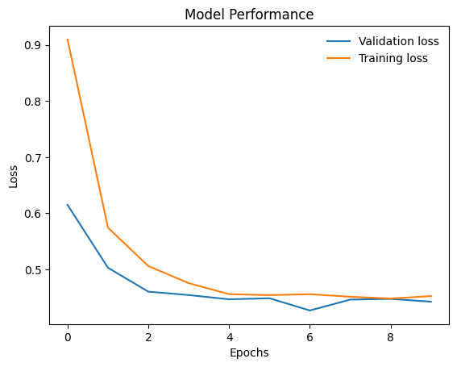

# Intel Image Classification with Wide ResNet-50-2

This project uses PyTorch and torchvision to classify images from the Intel Image Classification dataset. A pre-trained Wide ResNet-50-2 model is fine-tuned for this task. The pipeline includes data preprocessing, model training, evaluation, and prediction, with results visualized for performance assessment.

## Table of Contents
1. [Installation](#installation)
2. [Dataset](#dataset)
3. [Usage](#usage)
4. [Model Architecture](#model-architecture)
5. [Training](#training)
6. [Evaluation](#evaluation)
7. [Prediction](#prediction)
8. [Performance](#performance)
9. [Visualization](#visualization)
10. [Contributing](#contributing)
11. [License](#license)

## Installation

To get started, clone this repository and install the required dependencies:

```bash
git clone https://github.com/your-username/intel-image-resnet-classifier.git
cd intel-image-resnet-classifier
pip install -r requirements.txt
```

## Dataset

Download the Intel Image Classification dataset and extract it. Place the dataset in the following directory structure:

```
intel-image-resnet-classifier/
├── seg_train/
│   ├── seg_train/
│   ├── ...
├── seg_test/
│   ├── seg_test/
│   ├── ...
├── seg_pred/
│   ├── seg_pred/
│   ├── ...
```

## Usage

Run the script to preprocess data, train the model, and evaluate its performance:

```bash
python main.py
```

## Model Architecture

The model used is a pre-trained Wide ResNet-50-2, with the final fully connected layer modified to fit the number of classes in the Intel Image Classification dataset.

## Training

The training process includes:

1. **Data Preprocessing**:
   - Images are resized, normalized, and augmented using torchvision transforms.

2. **Data Loaders**:
   - Data is loaded into training, validation, and test sets using PyTorch's DataLoader.

3. **Model Training**:
   - A pre-trained Wide ResNet-50-2 model is fine-tuned on the dataset.
   - Only the final layer is trained while the rest of the model parameters are frozen.

4. **Optimization**:
   - The model is trained using the SGD optimizer with a learning rate scheduler.

## Evaluation

The model's performance is evaluated on the validation set after each epoch. The model with the lowest validation loss is saved as `best_model.pt`.

## Prediction

The trained model can be used to predict the class of new images. The script includes a function to load and preprocess images for prediction.

## Performance

The performance of the model is assessed using several metrics:

1. **Training and Validation Loss**:
   - Loss values are recorded for each epoch, allowing for the analysis of the model's learning progress and overfitting.

2. **Accuracy**:
   - Accuracy is measured on both the training and validation sets. This helps in understanding how well the model is generalizing to unseen data.

3. **Precision, Recall, and F1-Score**:
   - These metrics provide a detailed understanding of the model's performance, especially in multi-class classification scenarios.

## Visualization

The training and validation losses are plotted to visualize the model's performance over epochs. Additionally, predictions on a subset of test images are displayed.

```python
plt.plot(validation_losses, label='Validation loss')
plt.plot(training_losses, label='Training loss')
plt.title('Model Performance')
plt.xlabel('Epochs')
plt.ylabel('Loss')
plt.legend(frameon=False)
plt.show()
```
<p align="center">
  
</p>
<p align="center"><em>Model Performance</em></p>
